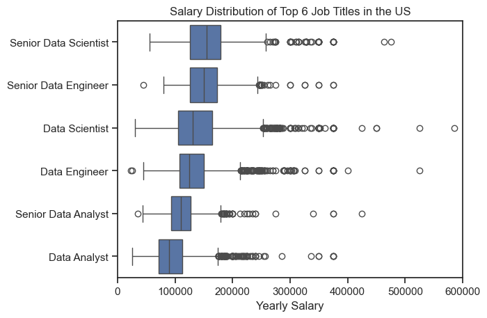

# The Analysis

## 1. What are the most demanded skills for the top 3 most popular data roles in the US?

To find the five most in demand skills for the three most popular roles in the field of Data(Analyst, Engineer and Scientist). This helps anyone plan a roadmap to enter the field of data by giving a general analysis of what is currently most wanted by various companies.

View my notebook with detailed steps here: [skill_demand_project.ipynb] (skill_demand_project.ipynb)

### Data Visualization

```python
fig, ax = plt.subplots(len(job_titles), 1)

sns.set_theme(style = 'ticks')

for i, job_title in enumerate(job_titles):
    df_plot = df_skills_perc[df_skills_perc['job_title_short'] == job_title].head(5)
    #df_plot.plot(kind='barh', x='job_skills', y='skill_percent', ax=ax[i], title=job_title)
    sns.barplot(data=df_plot, x='skill_percent', y='job_skills', ax=ax[i], hue = 'skill_count', palette = 'dark:b_r')
    ax[i].set_ylabel('')
    ax[i].set_xlabel('')
    ax[i].set_title(job_title)
    ax[i].legend().remove()
    ax[i].set_xlim(0, 100)

    for n, value in enumerate(df_plot['skill_percent']):
        ax[i].text(value+1, n, f'{value:.2f}%', va='center')

    if i != len(job_titles) - 1:
        ax[i].set_xticks([])
        
fig.suptitle('Likelihood of a skill being required for a job posting')
plt.tight_layout()
plt.show()
```

### Results


### Insights

Data Analyst:

    Strong reliance on SQL (50.8%) for querying and data manipulation.
    Excel (40.58%) is still highly relevant for reporting and analysis.
    Tableau (28.48%) for dashboarding and visualization.

Data Engineer:

    Heavy emphasis on SQL (68.3%) and Python (64.89%) for managing data pipelines.
    Cloud technologies (AWS, Azure) and Spark highlight a need for distributed computing and cloud-based solutions.

Data Scientist:

    Python (72.04%) is the most essential tool for data science and machine learning.
    SQL (51.05%) remains crucial for data retrieval.
    R (44.23%) is prominent for statistical modeling.

Industry Implications:

    SQL remains a core skill across all data roles.
    Data Engineers require cloud and big data expertise, while Data Scientists focus more on Python and statistical tools.
    Data Analysts use business intelligence tools like Excel and Tableau to communicate insights.
    SAS is declining in demand but still relevant in some analyst and data science roles.

Takeaways:

    Aspiring Data Analysts → Learn SQL, Excel, and Tableau.
    Aspiring Data Engineers → Gain expertise in SQL, Python, AWS, Azure, and Spark.
    Aspiring Data Scientists → Focus on Python, SQL, R, and machine learning.

## 2. How are in-demand skills trending for Data Analysts?


### Data Visualization:

```python
from matplotlib.ticker import PercentFormatter

df_plot = df_DA_US_percent.iloc[:, :5]
sns.lineplot(data=df_plot, dashes=False, legend='full', palette='tab10')
sns.set_theme(style='ticks')
sns.despine()

plt.title('Trending Top Skills for Data Analysts in the US')
plt.ylabel('Likelihood in Job Posting')
plt.xlabel('2023')
plt.legend().remove()
plt.gca().yaxis.set_major_formatter(PercentFormatter(decimals=0))

for i in range(5):
    plt.text(11.2, df_plot.iloc[-1, i], df_plot.columns[i], color='black')

plt.show()
```
### Insights

    SQL dominates job postings (~60%) but sees a slight decline mid-year. It's a must-have skill.

    Excel remains important but trends downward after August, possibly due to shifts toward advanced tools.

    Python and Tableau compete closely, with Python gaining slight preference.

    Power BI, though least in demand, shows gradual growth, hinting at rising adoption.

Takeaways:

    Master SQL—it’s essential.

    Excel is still useful, but learning Python and BI tools boosts opportunities.

    Power BI is on the rise—gaining proficiency may provide a competitive edge.

## 3. How well do jobs and skills pay for top jobs in the field of data?

### Salary Analysis


```python
sns.boxplot(data=df_US_top_jobs, x='salary_year_avg', y='job_title_short', order = job_order)
sns.set_theme(style = 'ticks')

plt.title('Salary Distribution of Top 6 Job Titles in the US')
plt.xlabel('Yearly Salary')
plt.ylabel('')
plt.xlim(0,600000)
ticks_x = plt.FuncFormatter(lambda y, pos: f'${int(y/1000)}K')
plt.show()
```

```python
fig, ax = plt.subplots(2, 1)

sns.set_theme(style = 'ticks')
sns.barplot(data = df_DA_top_pay, x = 'median', y = df_DA_top_pay.index, ax = ax[0], hue = 'median', palette = 'dark:b_r')
ax[0].set_title('Top 10 Skills for Data Analysts by Salary')
ax[0].set_xlabel('')
ax[0].set_ylabel('')
ax[0].legend().remove()
ax[0].xaxis.set_major_formatter(ticks_x)

sns.barplot(data = df_DA_skills, x = 'median', y = df_DA_skills.index, ax = ax[1], hue = 'median', palette = 'light:b')
ax[1].set_title('Top 10 in demand Skills for Data Analysts')
ax[1].set_xlabel('')
ax[1].set_ylabel('')
ax[1].legend().remove()
ax[1].xaxis.set_major_formatter(ticks_x)
ax[1].set_xlim(0, 200000)

fig.tight_layout()
```

### Insights

    Higher salaries: Senior roles (Data Scientist, Data Engineer) earn significantly more, with some exceeding $400K. Data Analysts have the lowest salaries.
    High-paying skills: Specialized tools like dplyr, solidity, and bitbucket lead to higher salaries.
    Most in-demand skills: Python, SQL, Excel, and Tableau dominate job postings.
    Career growth: To move beyond a Data Analyst role, focus on programming, cloud computing, and machine learning.

## 4. What is the most optimal skill to learn for Data Analysts?

### Data Visualization
![Scatter plot for optimal skills]](image-4.png)

```python
from adjustText import adjust_text

#df_plot.plot(kind='scatter', x='skill_percent', y='median_salary')
sns.scatterplot(data = df_plot, x='skill_percent', y='median_salary', hue='technology')
sns.despine()
sns.set_style("ticks")

texts = []
for i in range(len(df_plot)):  
    texts.append(plt.text(df_plot['skill_percent'].iloc[i], df_plot['median_salary'].iloc[i], df_plot['skills'].iloc[i]))


adjust_text(texts, arrowprops=dict(arrowstyle='->', color='red'))

plt.xlabel('Percent of Data Analyst Jobs')
plt.ylabel('Median Salary')
plt.title('Optimal Skills for Data Anlaysis Jobs in the US')

from matplotlib.ticker import PercentFormatter

ax = plt.gca()
ax.yaxis.set_major_formatter(plt.FuncFormatter(lambda y, pos: f'${int(y/1000)}K'))
ax.xaxis.set_major_formatter(PercentFormatter(decimals = 2))

plt.show()
```

### Insights

High-Paying & In-Demand Skills:

    Python and SQL stand out as the most valuable skills, offering both high salaries (~$98K) and strong demand (high job percentage).
    Tableau and Power BI, key data visualization tools, also provide competitive salaries (~$92K–$90K) with decent job market demand.

Low-Paying but High-Demand Skills:

    Excel has the highest job demand (50%) but offers a relatively lower median salary ($85K).
    Word and PowerPoint are frequently required but offer minimal salary boosts, making them less impactful for salary growth.

Niche but Lucrative Skills:


    Go (programming language) and Oracle (database) appear in the higher salary range (~$96K+), despite lower job demand (~10%).
    SQL Server is less common than standard SQL but still provides stable salaries (~$83K).


Takeaways:

    Prioritize Python, SQL, Tableau, and Power BI for balanced demand and salary.
    Learning Go, Oracle, or cloud technologies can boost earnings but might limit job opportunities.
    Excel, PowerPoint, and Word are useful but shouldn’t be the primary focus for maximizing salary.